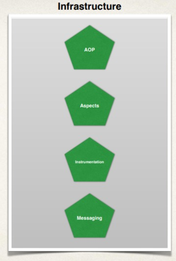

# Introduction au cours

### Objectif principal

+ Apprenez à créer des applications **Java** avec **Spring Boot** et **Hibernate**

### Vous apprendrez à…

+ Développer des applications **Spring Boot**
+ Tirer parti d'**Hibernate/JPA** pour accéder à la base de données
+ Développer une **API REST** à l'aide de **Spring Boot**
+ Créer une application **Spring MVC** avec **Spring Boot**
+ Connectez les applications **Spring Boot** à une base de données pour le développement **CRUD**.
+ Appliquer **Spring Security** pour contrôler l'accès aux applications.
+ Tirer parti de toute la configuration **Java (pas de XML)** et de **Maven**

# Environnement de développement Java

### 1) Environnement de développement Java

+ Nous supposons que vous avez déjà une expérience avec Java

  + **POO, classes, interfaces, héritage, gestion des exceptions, collections**

+ Vous devriez avoir les éléments suivants déjà installés
  + Kit de développement *Java (JDK)–Spring Boot 3* nécessite *JDK17* ou version ultérieure.
  + IDE Java (nous utiliserons IntelliJ, mais n'importe quel IDE Java fonctionnera)

### 2) À propos d'IntelliJ
+ Dans ce cours, nous utiliserons la version gratuite d'IntelliJ
+ Connu sous le nom d'IntelliJ Community Edition
+ Téléchargez depuis : https://www.jetbrains.com/idea/download
+ Sélectionnez l'édition communautaire.
+ Vous pouvez également utiliser **l'Ultimate Edition ($)…** une version d'essai gratuite est disponible.

### 3) Point de contrôle de l'environnement de développement Java
+ Vous devriez avoir les éléments suivants déjà installés
+ Kit de développement **Java (JDK)-Spring Boot 3** nécessite **JDK17** ou version ultérieure.
+ **IDE Java** (nous utiliserons **IntelliJ**, mais n'importe quel IDE Java fonctionnera)
+ Avant de poursuivre le cours
+ Assurez-vous que vous pouvez exécuter une application **Java HelloWorld** de base dans votre IDE Java.

# Présentation de Spring Boot

### 1) Spring en quelques mots
+ Framework très populaire pour créer des applications Java
+ Fournit un grand nombre de classes d'assistance et d'annotations

### 2) Le problème
+ Construire une application **Spring traditionnelle** est vraiment **DIFFICILE !!!**

+ Beaucoup de questions peuvent être soulevées : 

    + De quelles dépendances `JAR` ai-je besoin pour ce projet **Spring** ? 
    + Comment établir la configuration ? Dois-je utiliser la configuration **XML** ou la configuration **JAVA**
    + Comment installer le serveur ? (Tomcat, JBoss, WebSphere etc...)

### 3) Solution de Spring Boot
+ Facilitez le démarrage du développement Spring.
+ Réduire au minimum la quantité de configuration manuelle
+ Effectuer une configuration automatique basée sur les fichiers d'accessoires et le chemin de classe JAR.
+ Aide à la résolution des conflits de dépendances (Maven ou Gradle)
+ Fournissez un serveur HTTP intégré pour que vous puissiez démarrer rapidement
  + Tomcat, Jetty, Undertow, …

### 4) Spring Boot et Spring
+ **Spring Boot** utilise **Spring** en coulisses
+ **Spring Boot** facilite simplement l'utilisation de **Spring**

### 5) Spring Initializr

+ Créez rapidement un projet **Spring Boot** de démarrage
+ Sélectionnez vos **dépendances**
+ Crée un projet **Maven/Gradle**
+ Importez le projet dans votre **IDE**
    + Eclipse, IntelliJ, NetBeans etc…
+ Documentation
    + [Spring Initializr](http://start.spring.io)

### 6) Serveur embarqué Spring Boot
+ Fournissez un serveur **HTTP** intégré pour que vous puissiez démarrer rapidement
+ **Tomcat, Jetty, Undertow, …**
+ Pas besoin d'installer un serveur séparément

### 7) Exécuter des applications Spring Boot
+ Les applications **Spring Boot** peuvent être exécutées de manière autonome (inclut le serveur intégré)
+ Exécutez l'application **Spring Boot** à partir de l'IDE ou de la ligne de commande.

### 8) Déploiement des applications Spring Boot
+ Les applications Spring Boot peuvent également être déployées de manière traditionnelle.
+ Déployez le fichier WAR (Web Application Archive) sur un serveur externe :
  + Tomcat, JBoss, WebSphere etc…

#### FAQ n°1 sur le démarrage de Spring

+ **Q : Spring Boot remplace-t-il Spring MVC, Spring REST, etc. ?**

  +  Non. Spring Boot utilise réellement ces technologies.

#### FAQ sur le démarrage de Spring #2
+ **Q: Spring Boot exécute-t-il le code plus rapidement que le code Spring standard ?**

  + Non.
  + En coulisses, **Spring Boot** utilise le même code que **Spring Framework**
  + N'oubliez pas que **Spring Boot** vise à faciliter le démarrage.
  + Minimiser la configuration etc…

### FAQ n°3 sur le démarrage de Spring
+ **Q: Ai-je besoin d’un IDE spécial pour Spring Boot ?**

  + Non.
  + Vous pouvez utiliser n'importe quel IDE pour les applications Spring Boot… même utiliser un éditeur de texte brut
  + L'équipe Spring fournit gratuitement Spring Tool Suite (STS) [plugins IDE]
  + Certains IDE fournissent une prise en charge sophistiquée des outils Spring.
  + Pas une exigence. N'hésitez pas à utiliser l'IDE qui vous convient le mieux

# Demo Spring Initializr

### 1) Spring Initializr
+ Créez rapidement un projet Spring de démarrage
+ Sélectionnez vos dépendances
+ Crée un projet Maven/Gradle
+ Importez le projet dans votre IDE
+ Eclipse, IntelliJ, NetBeans etc…

### 2) Un mot rapide sur Maven
+ Lors de la création de votre projet Java, vous aurez peut-être besoin de fichiers JAR supplémentaires.
  + Par exemple : **Spring, Hibernate, Commons Logging, JSON etc…**
+ Une approche consiste à télécharger les fichiers **JAR** à partir du site Web de chaque projet.
+ Ajoutez manuellement les fichiers **JAR** à votre chemin de construction/chemin de classe.

### 3) Solution Maven

+ Indiquez à Maven les projets sur lesquels vous travaillez (dépendances)
  + Printemps, Hibernation etc….
+ **Maven** sortira et téléchargera les fichiers JAR pour ces projets pour vous
+ Et **Maven** rendra ces fichiers **JAR** disponibles lors de la compilation/exécution
+ Considérez Maven comme votre assistant **amical/personnel**

### 4) Processus de développement
1. Configurez notre projet sur le site **Web Spring Initializr**
2. Téléchargez le fichier zip
3. Décompressez le fichier
4. Importez le projet dans notre IDE

# Spring Boot - Créer un contrôleur REST

### 1) Contrôleur REST
+ Créons un contrôleur **REST** très simple

### 2) Créer un contrôleur REST

# Présentation Spring Framework

### 1) Site Web de Spring - Officiel

+ [Spring WebSite-Official](https://www.spring.io)

### 2) Pourquoi Spring ?
+ Simplifiez le développement Java Enterprise

### 3) Objectifs du printemps
+ Développement léger avec des POJO Java (Plain-Old-Java-Objects)
+ Injection de dépendances pour favoriser le couplage lâche
+ Programmation déclarative avec programmation orientée aspect (AOP)
+ Réduire au minimum le code Java standard

# Projets Spring

### Que sont les « projets » du printemps

+ Modules Spring supplémentaires intégrés au framework Spring principal.
+ Utilisez uniquement ce dont vous avez besoin…
+ Spring Cloud, Spring Data
+ Spring Batch, Spring Security
+ Spring Web Services, Spring LDAP
+ autres ...

# Maven

### 1) Spring Boot et Maven

+ Lorsque vous générez des projets à l'aide de **Spring Initializr: start.spring.io**
+ Il peut générer un projet Maven pour vous
+ Dans cette section, nous apprendrons les bases de **Maven**
+ Affichage des dépendances dans le **fichier pom.xml Maven**
+ Démarreurs Spring Boot pour **Maven**

### 2) Qu’est-ce que Maven ?
+ Maven est un outil de gestion de projet
+ L'utilisation la plus populaire de Maven concerne la gestion des builds et des dépendances.

### 3) Quels problèmes Maven résout-il ?
+  Lors de la création de votre projet Java, vous aurez peut-être besoin de fichiers JAR supplémentaires.
  + Par exemple : Spring, Hibernate, Commons Logging, JSON etc…
+ Une approche consiste à télécharger **les fichiers JAR** à partir du site Web de chaque projet.
+ Ajoutez manuellement **les fichiers JAR** à votre chemin de construction/chemin de classe.

### 4) Solution Maven
+ Indiquez à Maven les projets sur lesquels vous travaillez (dépendances)
  + Spring Hibernate etc ….
+ Maven sortira et téléchargera les fichiers JAR pour ces projets pour vous
+ Et Maven rendra ces fichiers JAR disponibles lors de la compilation/exécution
+ Considérez Maven comme votre assistant amical/acheteur personnel

### Mon projet avec Maven

Maven - Comment ça marche

Gestion des dépendances JAR
• Lorsque Maven récupère une dépendance de projet
• Il téléchargera également les dépendances de support
• Par exemple : Spring dépend de la journalisation commune…
• Maven s'en chargera automatiquement pour nous

Construire et exécuter
• Lorsque vous créez et exécutez votre application…
• Maven gérera le chemin de classe/construction pour vous
• En fonction du fichier de configuration, Maven ajoutera les fichiers JAR en conséquence

Structure de répertoire standard
• Normalement lorsque vous rejoignez un nouveau projet
• Chaque équipe de développement imagine sa propre structure de répertoires
• Pas idéal pour les nouveaux arrivants et non standardisé
• Maven résout ce problème en fournissant une structure de répertoires standard

